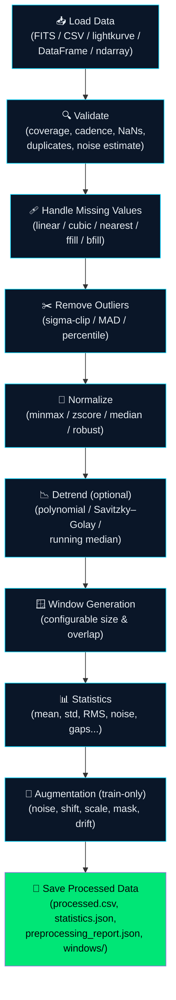

# 🔭 Cosmic Orbit — AI-Enabled Exoplanet Transit Detection

> **Bharatiya Antariksh Hackathon (BAH) 2026** — ISRO × Hack2skill  
> **Problem Statement #07**: AI-enabled Detection of Exoplanets from Noisy Astronomical Light Curves

[](https://python.org)
[](https://tensorflow.org)
[](LICENSE)

An end-to-end AI pipeline that automatically detects exoplanet transit signals (tiny brightness dips when a planet crosses its host star) from noisy real-world astronomical light curve data.

---

## 🏗️ Architecture

```
┌─────────────────────────────────────────────────────────────────┐
│                    COSMIC ORBIT PIPELINE                        │
│                                                                 │
│  📊 Noisy         🧹 Denoising       📐 Feature    🧠 CNN/LSTM │
│  Light Curve  →   Autoencoder    →   Extraction →  Classifier  │
│  (Kepler/TESS)   (Conv1D AE)       (BLS Search)   (Transit     │
│                  Noise removed,     Period, Depth,  Probability) │
│                  signal preserved   Duration, SNR   [0, 1]      │
│                                                                 │
│                        ↓                    ↓                   │
│                  ✅ Detection Output: Exoplanet Confirmed / Not │
│                  📊 Streamlit Dashboard with Visual Comparison   │
└─────────────────────────────────────────────────────────────────┘
```


---

## 🧪 Preprocessing Framework

The preprocessing layer (`src/`) is a modular, configurable pipeline that prepares raw Kepler/TESS light curves for the two-stage AI model above. It is additive to the original `src/preprocessing.py` / `src/data_pipeline.py` — those files and their public functions (`normalize_flux`, `create_windows`, `generate_synthetic_dataset`, `prepare_classification_dataset`, `load_lightcurve`, etc.) are unchanged and still work exactly as before. The new framework adds configurability, validation, and reproducibility on top.

### Pipeline stages



Every stage logs its execution time, sample count, and any warnings/errors, and every run is reproducible via a fixed `random_seed`.

### Supported input formats (Section 1)

`src/input_adapters.py` auto-detects and normalizes any of the following into a plain `(time, flux)` pair:

| Input | Example |
|-------|---------|
| Lightkurve `LightCurve` object | `load_input(lc)` |
| FITS file | `load_input("data/raw/kepler10.fits")` |
| CSV file | `load_input("data/raw/kepler10.csv")` |
| NumPy arrays | `load_input((time_array, flux_array))` or a single `(N, 2)` array |
| Pandas DataFrame | `load_input(df, time_col="BJD", flux_col="PDCSAP_FLUX")` |

Common column-name variants (`time`/`BJD`/`BKJD`/`BTJD`, `flux`/`PDCSAP_FLUX`/`SAP_FLUX`) are auto-detected for CSV/DataFrame input; astropy (already a project dependency) is required for FITS files, and lightkurve is only imported when a `LightCurve` object is actually passed in.

### Configuration (Section 10)

All stages are driven by [`config/preprocessing.yaml`](config/preprocessing.yaml), loaded via `src/preprocessing_config.py`:

```yaml
random_seed: 42

missing_values:
  strategy: linear          # linear | cubic | nearest | ffill | bfill

outliers:
  method: sigma_clip        # sigma_clip | mad | percentile
  sigma_threshold: 5.0

normalization:
  method: median             # minmax | zscore | median | robust

detrending:
  enabled: false             # off by default -- models were trained on un-detrended data
  method: savgol              # polynomial | savgol | running_median

windowing:
  window_size: 2001
  overlap: 0.75

augmentation:
  enabled: false              # train-time only, never applied at inference
```

Any key you omit falls back to a sensible default, so a partial config file is safe.

### Usage example

```python
from src.preprocessing_pipeline import PreprocessingPipeline
from src.preprocessing_config import load_preprocessing_config

# Load config (or omit to use config/preprocessing.yaml defaults)
cfg = load_preprocessing_config()

pipeline = PreprocessingPipeline(config=cfg)

# Run directly on any supported input type (FITS, CSV, DataFrame, arrays, lightkurve object)
result = pipeline.run_from_source(
    "data/raw/kepler10b.fits",
    save_output=True,   # writes processed.csv, statistics.json, preprocessing_report.json, windows/
)

print(result.validation_report.summary())
print(result.statistics.to_dict())
print(f"Generated {len(result.windows)} windows")

for stage in result.stage_logs:
    print(f"{stage.stage_name:22s} {stage.execution_time_sec:.3f}s  n={stage.n_samples}")
```

Each run writes to `data/processed/<target_id>/`:

```
processed/<target_id>/
├── processed.csv               # final (time, flux) after validation/cleaning/normalization
├── statistics.json             # Section 9 descriptive statistics
├── metadata.json                # normalization params, outlier stats
├── preprocessing_report.json   # full validation report + per-stage execution log
└── windows/
    └── windows.npz              # stacked (n_windows, window_size) flux/time arrays + window IDs
```

### Preprocessing module reference

| Module | Section | Purpose |
|--------|---------|---------|
| `src/input_adapters.py` | 1 | Auto-detect and load FITS/CSV/DataFrame/ndarray/lightkurve input |
| `src/data_validation.py` | 2 | Pre-processing quality report (coverage, cadence, NaNs, noise) |
| `src/missing_values.py` | 3 | Configurable NaN-filling strategies |
| `src/outlier_detection.py` | 4 | Sigma-clip / MAD / percentile outlier removal |
| `src/normalization.py` | 5 | Min-max / z-score / median / robust normalization |
| `src/detrending.py` | 6 | Optional polynomial / Savitzky–Golay / running-median detrending |
| `src/windowing.py` | 7 | Configurable sliding-window segmentation with metadata & IDs |
| `src/augmentation.py` | 8 | Train-time-only noise/shift/scale/mask/drift augmentation |
| `src/feature_statistics.py` | 9 | Per-light-curve descriptive statistics |
| `src/preprocessing_config.py` | 10 | Typed YAML configuration loader |
| `src/preprocessing_pipeline.py` | 11–13 | Orchestrates all stages, structured logging, structured output |

Run the test suite covering all of the above with:

```bash
pytest tests/ -v
```

---


### 1. Clone & Install

```bash
git clone https://github.com/SaitirthaBehera/Exoplanet-Detection.git
cd Exoplanet-Detection
pip install -r requirements.txt
```

### 2. Download Data (Data pipeline & preprocessing)

```python
from src.data_pipeline import download_all_targets

# Downloads Kepler light curves for 5 known exoplanet systems
filepaths = download_all_targets()
print(filepaths)
```

### 3. Generate Synthetic Training Data

```python
from src.preprocessing import generate_synthetic_dataset

# Creates 5000 matched noisy/clean pairs with transit labels
noisy, clean, labels = generate_synthetic_dataset(n_samples=5000)
print(f"Training data: {noisy.shape}")  # (5000, 2001, 1)
```

### 4. Train Models (Model architecture)

```python
from src.autoencoder import build_autoencoder, train_autoencoder, save_autoencoder
from src.classifier import build_classifier, train_classifier, save_classifier
from src.preprocessing import prepare_classification_dataset

# Stage 1: Denoising Autoencoder
ae_model = build_autoencoder(window_size=2001)
ae_history = train_autoencoder(ae_model, noisy, clean, epochs=50)
save_autoencoder(ae_model)

# Stage 2: CNN-LSTM Classifier
X_train, X_test, y_train, y_test = prepare_classification_dataset(noisy, clean, labels)
clf_model = build_classifier(window_size=2001)
clf_history = train_classifier(clf_model, X_train, y_train, epochs=50)
save_classifier(clf_model)
```

### 5. Validate Against Known Exoplanets (Validation and benchmarking)

```python
from src.validation import run_benchmark, generate_report
from src.feature_extraction import extract_all_features

results = run_benchmark(
    pipeline_func=lambda time, flux: extract_all_features(time, flux)
)
print(generate_report(results))
```

### 6. Launch Dashboard (Visualization)

```bash
streamlit run app/streamlit_app.py
```

---

## 📁 Project Structure

```
bah-2026-exoplanet-detection/
├── src/
│   ├── __init__.py              # Package init
│   ├── config.py                # 🔧 Shared constants & hyperparameters
│   ├── data_pipeline.py         # 📡 Person B: lightkurve data download & cleaning
│   ├── preprocessing.py         # 🔄 Normalization, windowing, synthetic data (legacy, unchanged)
│   ├── autoencoder.py           # 🧹 Person A: Conv1D denoising autoencoder
│   ├── classifier.py            # 🧠 Person A: CNN-LSTM transit classifier
│   ├── feature_extraction.py    # 📐 BLS period search & transit parameters
│   ├── validation.py            # ✅ Person C: NASA API benchmark & metrics
│   │
│   ├── input_adapters.py        # 🧪 Section 1: FITS/CSV/DataFrame/ndarray/lightkurve input
│   ├── data_validation.py       # 🧪 Section 2: pre-processing data quality report
│   ├── missing_values.py        # 🧪 Section 3: configurable NaN-filling strategies
│   ├── outlier_detection.py     # 🧪 Section 4: sigma-clip / MAD / percentile outliers
│   ├── normalization.py         # 🧪 Section 5: minmax / zscore / median / robust
│   ├── detrending.py            # 🧪 Section 6: polynomial / Savitzky–Golay / running median
│   ├── windowing.py             # 🧪 Section 7: configurable sliding-window segmentation
│   ├── augmentation.py          # 🧪 Section 8: train-time-only augmentation
│   ├── feature_statistics.py    # 🧪 Section 9: per-light-curve descriptive statistics
│   ├── preprocessing_config.py  # 🧪 Section 10: typed YAML configuration loader
│   └── preprocessing_pipeline.py # 🧪 Section 11-13: pipeline orchestration & structured output
├── config/
│   └── preprocessing.yaml       # 🔧 Preprocessing pipeline configuration
├── tests/
│   └── test_*.py                 # ✅ Unit + integration tests for the preprocessing framework
├── app/
│   └── streamlit_app.py         # 📊 Person D: Interactive dashboard
├── models/                      # Saved model weights (.keras)
├── data/
│   ├── raw/                     # Downloaded light curves (.npy)
│   └── processed/               # Preprocessed segments (processed.csv, statistics.json, windows/...)
├── docs/
│   └── architecture.md          # Technical architecture document
├── requirements.txt
├── README.md
└── .gitignore
```

---

## 🎯 Target Exoplanets

| Planet | Mission | Period (d) | Depth (ppm) | Difficulty |
|--------|---------|-----------|-------------|------------|
| **HAT-P-7b** | Kepler | 2.20 | 6,180 | Easy (hot Jupiter) |
| **Kepler-10b** | Kepler | 0.84 | 152 | Medium (rocky) |
| **Kepler-22b** | Kepler | 289.86 | 492 | Medium (habitable zone) |
| **Kepler-90g** | Kepler | 210.61 | 335 | Hard (multi-planet) |
| **Kepler-452b** | Kepler | 384.84 | 84 | Very Hard (Earth-like) |

---

## 🧠 Model Architectures

### Denoising Autoencoder (Stage 1)
```
Input (2001, 1)
  ├── Conv1D(64, k=7, relu) → MaxPool(2)    [Encoder]
  ├── Conv1D(32, k=7, relu) → MaxPool(2)
  ├── Conv1D(16, k=7, relu)                  [Bottleneck]
  ├── Conv1DT(16, k=7, relu) → UpSample(2)  [Decoder]
  ├── Conv1DT(32, k=7, relu) → UpSample(2)
  └── Conv1D(1, k=7, linear)                 [Output]
Loss: MSE | Optimizer: Adam(lr=1e-3)
```

### CNN-LSTM Classifier (Stage 2)
```
Input (2001, 1)
  ├── Conv1D(64, k=5, relu) → BN → MaxPool(4)  [Feature Extraction]
  ├── Conv1D(128, k=5, relu) → BN → MaxPool(4)
  ├── LSTM(64)                                    [Temporal]
  ├── Dropout(0.3) → Dense(64, relu)             [Classification]
  ├── Dropout(0.3) → Dense(1, sigmoid)
Loss: Binary Cross-Entropy | Optimizer: Adam(lr=1e-4)
Class Weights: {no-transit: 1.0, transit: 5.0}
```

---

## 🔧 Tech Stack

| Component | Technology |
|-----------|-----------|
| Language | Python 3.10+ |
| ML Framework | TensorFlow / Keras |
| Data Source | NASA Exoplanet Archive, Kepler/TESS via `lightkurve` |
| Processing | Pandas, NumPy, SciPy |
| Visualization | Streamlit, Matplotlib, Seaborn |
| Validation | NASA Exoplanet Archive TAP API |
| Compute | Google Colab (free GPU) |
| Version Control | GitHub |

---

## 👥 Team Cosmic Orbit

| Role | Name | Responsibility |
|------|------|---------------|
| **Team Leader** | Saitirtha Behera | Project management & integration |
| **Member 1** | Subhandu Sekhar Routray | Model architecture (autoencoder + classifier) |
| **Member 2** | Swayamswaroop Meher | Data pipeline & preprocessing |
| **Member 3** | Subhrajeet Parida | Validation & benchmarking |

**College**: Institute of Technical Education and Research (ITER), SOA University

---

## 📄 License

This project is built for the **Bharatiya Antariksh Hackathon (BAH) 2026** organized by **ISRO × Hack2skill**.

Built entirely using open-source tools, publicly available NASA datasets, and VS Code.  
**Estimated implementation cost: ₹0**

---

<p align="center">
  <strong>🇮🇳 Jai Hind | जय हिंद</strong><br>
  <em>Built with ❤️ for India's space exploration mission</em>
</p>
