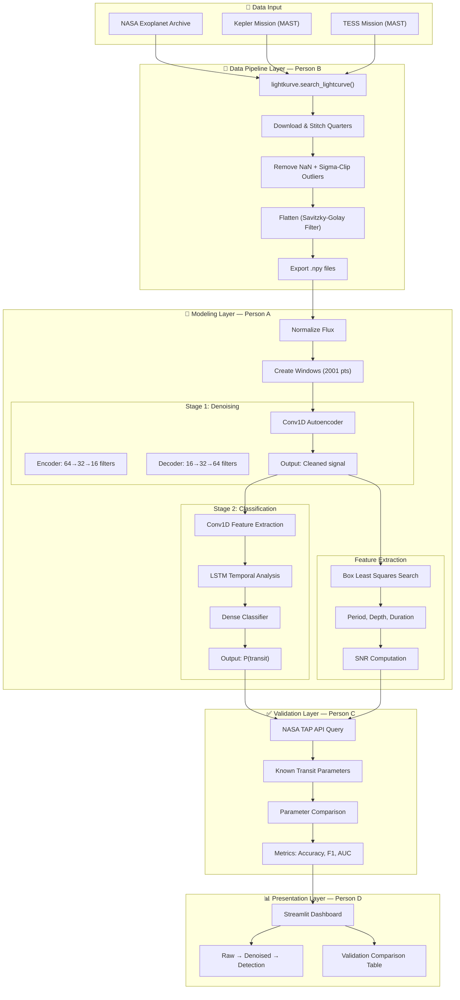

# Architecture Documentation

## Cosmic Orbit — AI-Enabled Exoplanet Transit Detection Pipeline
### BAH 2026 — ISRO × Hack2skill | Problem Statement #07

---

## Pipeline Overview



---

## Data Format Specifications

### Light Curve Storage (`.npy`)

All light curves are stored as NumPy arrays with shape `(N, 2)`:

| Column | Index | Type | Description |
|--------|-------|------|-------------|
| Time | 0 | float64 | Barycentric Julian Date (BJD) |
| Flux | 1 | float64 | Normalized relative flux |

**Normalization**: `flux = (raw_flux / median(raw_flux)) - 1`
- Baseline ≈ 0.0
- Transit dips → negative values (e.g., -0.001 = 1000 ppm depth)

### Model Input Format

| Shape | Description |
|-------|-------------|
| `(batch, 2001, 1)` | Windowed light curve segments |
| `(batch, 1)` | Classification labels (0 = no transit, 1 = transit) |

---

## Model Architecture Details

### Stage 1: Denoising Autoencoder

```mermaid
flowchart LR
    subgraph ENCODER["Encoder"]
        I["Input (2001, 1)"] --> P["ZeroPad → (2004, 1)"]
        P --> C1["Conv1D(64, k=7, relu)"]
        C1 --> M1["MaxPool1D(2) → (1002, 64)"]
        M1 --> C2["Conv1D(32, k=7, relu)"]
        C2 --> M2["MaxPool1D(2) → (501, 32)"]
        M2 --> C3["Conv1D(16, k=7, relu) → (501, 16)"]
    end

    subgraph DECODER["Decoder"]
        C3 --> CT1["Conv1DT(16, k=7, relu)"]
        CT1 --> U1["UpSample(2) → (1002, 16)"]
        U1 --> CT2["Conv1DT(32, k=7, relu)"]
        CT2 --> U2["UpSample(2) → (2004, 32)"]
        U2 --> CO["Conv1D(1, k=7, linear)"]
        CO --> CR["Crop1D(0, 3) → (2001, 1)"]
    end

    style ENCODER fill:#0A1628,stroke:#00D4FF
    style DECODER fill:#0A1628,stroke:#FF6B00
```



**Key Design Decisions**:
- **Padding strategy**: Input padded from 2001 → 2004 (nearest multiple of 4) to ensure dimension compatibility through encode/decode
- **Linear activation** on output: light curve values can be negative (transit dips)
- **Kernel size 7**: captures ~3.5 hours of Kepler long-cadence data per kernel

### Stage 2: CNN-LSTM Classifier


**Key Design Decisions**:
- **Conv1D → LSTM hybrid**: CNNs extract local transit shapes; LSTM captures periodicity
- **BatchNormalization**: stabilizes training on variable stellar data
- **Class weights {0: 1.0, 1: 5.0}**: compensates for transit rarity (~1% of data)
- **Aggressive pooling (4×)**: reduces LSTM input to manageable sequence length

---

## Feature Extraction (BLS)

The Box Least Squares algorithm searches for periodic box-shaped dips:

1. **Period Grid**: 50,000 points from 0.5 to 400 days (log-uniform)
2. **Duration Grid**: [0.05, 0.10, 0.15, 0.20, 0.25, 0.33] days
3. **Best Period**: argmax of BLS power spectrum
4. **Transit Parameters**: extracted from phase-folded curve at best period

---

## API Endpoints

### NASA Exoplanet Archive (Validation)

```
GET https://exoplanetarchive.ipac.caltech.edu/TAP/sync
    ?query=SELECT pl_name,pl_orbper,pl_trandep,pl_trandur FROM ps
           WHERE pl_name='Kepler-10 b' AND default_flag=1
    &format=csv
```

### MAST (Data Download via lightkurve)

```python
lightkurve.search_lightcurve(
    target="Kepler-10",
    mission="Kepler",
    author="Kepler"
)
```

---

## Validation Methodology

1. **Select** 5 known exoplanets spanning easy → hard difficulty
2. **Download** real Kepler light curves via MAST
3. **Run** full pipeline: denoise → extract features → classify
4. **Compare** detected parameters against NASA catalog values
5. **Pass/Fail** criteria:
   - Period: within 1% of known value
   - Depth: within 30% of known value
   - Duration: within 30% of known value

---

## Synthetic Data Generation

Training data is bootstrapped from synthetic light curves:

1. **Baseline**: flat signal (flux = 0 after normalization)
2. **Transit injection**: cosine-tapered box dips with randomized:
   - Depth: 50 – 20,000 ppm
   - Duration: 1% – 5% of window width
   - Center: random position
3. **Noise injection**: Gaussian (σ = 0.001) + slow sinusoidal trends
4. **Split**: 50% transit, 50% no-transit
5. **Augmentation**: random noise level variation (0.0005 – 0.003 σ)
